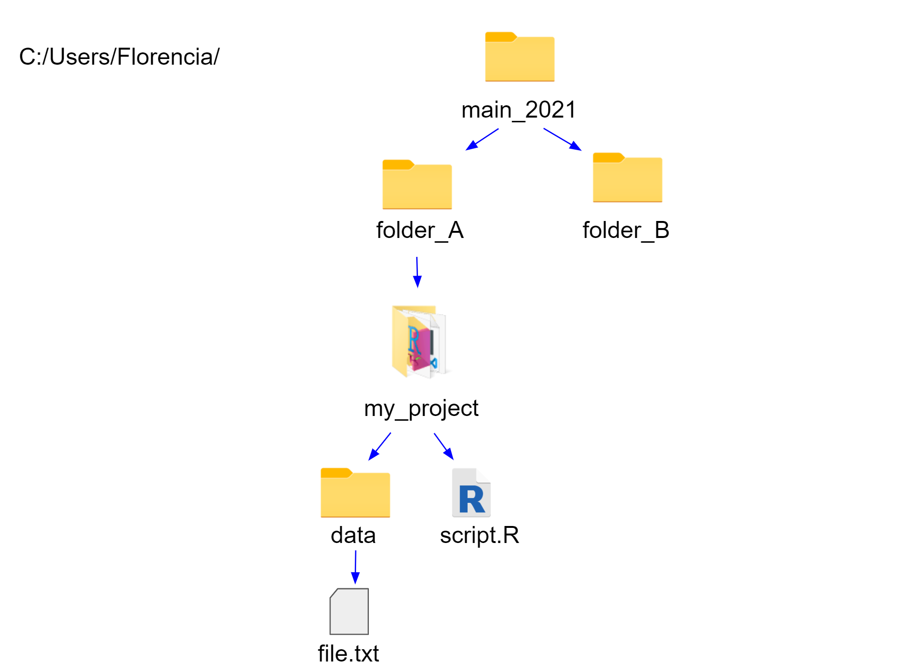
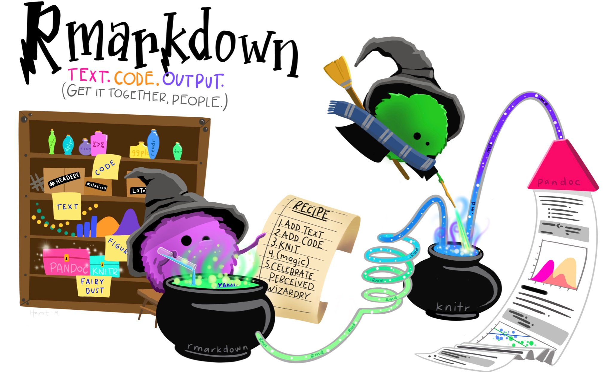
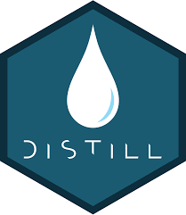

```{r setup, include=FALSE}
options(htmltools.dir.version = FALSE)
```

```{r xaringan-themer, include=FALSE, warning=FALSE}
library(xaringanthemer)
library(xaringanExtra)
library(tidyverse)
library(knitr)
library(nomnoml)
library(countdown)
xaringanExtra::use_logo(
  image_url = "https://raw.githubusercontent.com/rstudio/hex-stickers/master/PNG/xaringan.png"
)
xaringanExtra::use_panelset()
xaringanExtra::use_broadcast()
xaringanExtra::use_share_again()
xaringanExtra::style_share_again(share_buttons = c("twitter", "linkedin"))
xaringanExtra::use_tachyons()
xaringanExtra::use_fit_screen()
xaringanExtra::use_tile_view() # O
style_mono_accent(
  base_color = "#0dc96f",
  background_color = "#ffffff",
  inverse_background_color = "#3298cb",
  header_color = "#022044",
  inverse_header_color = "#ffffff", 
  inverse_text_color = "#ffffff",
  code_inline_color = "#179c55",
  link_color= "#0000FF",
  text_font_size = "25px",
  header_font_google = google_font("Poppins", "Regular", "400"),
  text_font_google   = google_font("Darker Grotesque", "500"),
  code_font_google   = google_font("Fira Mono"),
  )

```

```{r metathis, warning=FALSE, echo=FALSE}
# library(metathis)
# meta() %>%
#   meta_name("github-repo" = "flor14/rladies-jujuy") %>% 
#   meta_social(
#     title = "Meetup R-Ladies Jujuy",
#     description = paste(
#       "Mi próximo artículo científico con R:", 
#       "Compendios de Investigación, Reproducibilidad e",
#       "Interactividad en las publicaciones académicas"
#     ),
#     url = "https://flor14.github.io/rladies-jujuy/presentacion.html?panelset=licencia#1",
#     image = "https://res.cloudinary.com/flor/image/upload/v1608248822/jujuy-colores_frmvax.jpg",
#     image_alt = paste(
#       "Charla para el capítulo de R-Ladies de Jujuy, Argentina.",
#       "Diciembre de 2020"
#       ),
#     og_type = "website",
#     og_author = "Florencia D'Andrea",
#     twitter_card_type = "summary_large_image",
#     twitter_creator = "@cantoflor_87",
#     twitter_site = "@cantoflor_87"
#   )
```


class: middle, center

```{r hex, fig.align='center', echo = FALSE, out.width=150} 
    knitr::include_graphics("img/hex.png")
```


---


class: bottom

.bg-washed-blue.b--dark-blue.ba.bw2.br3.shadow-5.ph4.mt5[
### DSCI 521 - Lecture 6
### **YAML, Templates, Presentations, and Notebook formats**

 .large[#### Computing Platforms for Data Science - UBC MDS 2021/22
]]


---

## Lecture learning goals

1. Use `here` to define robust file paths

--

2. Specify metadata in the `YAML header` block

--

3. Use `R Markdown templates`

--

4. Create `presentations using R Markdown` (via xaringan) and using Jupyter notebooks

--

5. Sharing `rendered HTML files` publicly via GitHub Pages

---

class: middle, inverse

## Live Coding 1


 
Create a git project    
Use here to define robust file paths  


---

class: middle, center

### How I can recognize that I am working in a project when using RStudio?

---

### How I can recognize that I am working in a project when using RStudio?

```{r run, fig.align='center', echo = FALSE,out.width=900} 

```
---


## Working with projects


- Sets the the **working directory** to the root of the selected project folder

--

- You can start a project on a **Git repository**

--
  
- Keeps all your **files together**

--

- Previously edited source **documents are restored** into editor tabs

--

- More...
  
  
  
  
  
  
  
 

```{r hex44, fig.align='right', echo = FALSE, out.width=150} 

```

.footnote[[Using RStudio projects](https://support.rstudio.com/hc/en-us/articles/200526207-Using-Projects)]
---

## Working with projects

```{r s1, fig.align='right', echo = FALSE, out.width=900} 

```

---

## Working with projects

```{r s2, fig.align='center', echo = FALSE, out.width=700} 

```

Everything works fine! 

---

## script.R

#### 1. Absolute Path ✔️
```
readLines("C:/Users/Florencia/main_2021/folder_A/my_project/data/file.txt") 
```
#### 2. Relative Path ✔️
```
readLines("data/file.txt") 
```
#### 3. `here` package ️✔️
```
library(here)
path <- here("data", "file.txt")
readLines(path) 
```
.bg-washed-blue.b--dark-blue.ba.bw2.br3.shadow-5.ph4.mt5[
It  works!]


---


## Moving my project folder

```{r s3, fig.align='center', echo = FALSE, out.width=900} 

```


---


class: center, middle

## What code will run without errors?

#### 1 and 2  
#### 2 and 3  
#### 1, 2 and 3  


---

## script.R
##### C:/Users/Florencia/main_2021/**folder_B**/my_project/data/file.txt

#### 1. Absolute Path ❌   

--

#### 2. Relative Path ✔️

--

#### 3. `here` package ️✔️


.bg-washed-blue.b--dark-blue.ba.bw2.br3.shadow-5.ph4.mt5[
- When I am working in a **project**, the working directory is set to the root of the selected project folder
- It is safe to use **relative paths** even if I move the project folder]


---

## New folder `files` 
#### Try to run the content of `script.R` to a `notebook.Rmd`

```{r s4, fig.align='center', echo = FALSE, out.width=900} 

```

---

.pull-left[

## script.R

#### 1. Absolute Path ❌    

#### 2. Relative Path ✔️


#### 3. `here` package ️✔️
]

--

.pull-right[

## notebook.Rmd

#### 1. Absolute Path ❌

#### 2. Relative Path ❌ 
The current working directory inside a notebook chunk is always the directory containing the notebook `.Rmd` file. 

**Option** ️✔️
```
readLines("../data/file.txt") 
```

#### 3. `here` package ️✔️
]

--

.bg-washed-blue.b--dark-blue.ba.bw2.br3.shadow-5.ph4.mt5[
-  The notebook will work if you are careful writing the paths
- `here` package works in this case!]


---

class: middle, center

### What happen if you open `script.R` or `notebook.Rmd` outside a project?


---

#### 1. Absolute Path ❌    

#### 2. Relative Path ❌ 

#### 3. `here` package ️✔️

---


```{r ali2, fig.align='center', echo = FALSE, out.width=700} 
knitr::include_graphics("img/herealison.png")
```
.footnote[Illustration by Alison Horst]
---
 
## `here` package adds extra functionalities

- Makes sure that file paths work across operating systems 

--

- Accessible way to specify paths in your project’s `.R` and `.Rmd` files, regardless of where they live.

--

- The paths will work when you are outside the project too

--

**It does not replace the use of projects!**

.footnote[[More info about `here` here!](https://malco.io/2018/11/05/why-should-i-use-the-here-package-when-i-m-already-using-projects/) and in the [GitHub repo](https://github.com/jennybc/here_here)]


---

class: inverse, center, middle
### R Notebook / R Markdown document
#### What is the difference?

---


### R Notebook / R Markdown document
#### What is the difference?

**R Notebook**
- Output: html_notebook (**Preview** option available)
  
--
  
**RMarkdown** 
- Output: html_documents
- Templates, slides and more.


--
```{r hex3, fig.align='right', echo = FALSE, out.width=150} 
knitr::include_graphics("img/rmarkdown.png")
```

---

## R Markdown documents

```{r fefe, fig.align='right', echo = FALSE, out.width=400} 
knitr::include_graphics("img/output_formats.png")
```


.footnote[[R Markdown quick tour - RStudio](https://rmarkdown.rstudio.com/authoring_quick_tour.html)]


---

```{r ali, fig.align='center', echo = FALSE, out.width=700} 

```

.footnote[Picture by Alison Horst]
---

class: center, middle, inverse

# R Markdown 
# YAML header

---

### The YAML header 

- It is where we can specify **metadata** about our project. 
- It is delimited by **---** (three hyphens) 
- The indentation it is important!  

```
---
title: "R Notebook"
output: html_notebook
---
```

---

### The YAML header

We can add new values, for example the author name and the date.

```
---
title: "R Notebook"
*output: html_notebook
*author: Florencia
date: 2020-09-23
---
```


.footnote[R code can be evaluated inside the YAML header `r Sys.Date()`]
---

### The YAML header

##### Table of Contents
```
---
output:
  html_notebook:
    toc: yes
    toc_float: yes
    number_sections: yes
---
```

.footnote[[Document Templates](https://bookdown.org/yihui/rmarkdown/document-templates.html)]

---


class: center, middle, inverse

# R Markdown templates


---

## R Markdown templates

##### GitHub document

saves a .md markdown file and creates a temporary .html files for preview of how it will look on GitHub, which is stored in a temporary folder and later deleted. 
```
---
output: github_document
---
```

##### Word document

```
---
output: word_document
---
```

.footnote[[Custom Word Templates](https://bookdown.org/yihui/rmarkdown-cookbook/word-template.html)]

---

class: middle, center

# 🎨🖌️ 
## [R Markdown gallery](https://rmarkdown.rstudio.com/gallery.html)

---

class: middle, inverse

## Live Coding 2

Create presentations using R Markdown (via xaringan) and using Jupyter notebooks
Sharing rendered HTML files publicly via GitHub Pages 


---

class: middle, center, inverse


```{r hex2, fig.align='center', echo = FALSE, out.width=150} 
knitr::include_graphics("img/xarhex.png")
```

## Presentations with R Markdown via _xaringan_


---

### Presentations with R Markdown via `xaringan`

- An R package for creating slideshows with **remark.js** through R Markdown

- One of the templates you can use is to create a "Ninja presentation" using xaringan. 


.footnote[[GitHub repo `Xaringan` package](https://github.com/yihui/xaringan)]
---

## `xaringan`

#### Separate slides

#### -- (2 hyphens)

#### Class labels

- **inverse** inverts the colors
- **center** centers horizontally
- **middle** centers vertically

#### Organize elements on the slide

`.pull-left[]` and `.pull-right[]`


.footnote[[GitHub repo `xaringan` package](https://github.com/yihui/xaringan)]


---

class: middle, center
```{r xt, fig.align='center', echo = FALSE, out.width=150} 
knitr::include_graphics("img/xt.png")
```
## `xaringanthemer `
### (+ functions to `xaringan`)


---

## `xaringanthemer `

```
install.packages(c("xaringanthemer", "showtext"))
```

And then select to create a "themed" Ninja presentation via the same process as above.


.footnote[[GitHub repo `xaringanthemer` package](https://pkg.garrickadenbuie.com/xaringanthemer/)]

---

class: middle, center, inverse

# Sharing our slides 


---

# GitHub Pages

- **GitHub Pages** can create a public URL for any GitHub repository that you own, and automatically renders any HTML files within this repo. 

- By default, GitHub pages will render a `README.md` file or an `index.html` file 

```{r gp, fig.align='center', echo = FALSE, out.width=600} 

```

---

class: middle, center, inverse

## Creating presentations with JupyterLab


---

## Slides with JupyterLab 


- JavaScript framework: **reveal.js** 

- To mark which code cells should be part of the presentation, we can go to the property inspector (the settings wheel in the left side panel) and then select the slide type from the dropdown menu. 


[Slides from lecture0 are an example](https://flor14.github.io/jupyter/#/)


---


## Slides with JupyterLab 


- **Slide**: Standard slide navigated to via left and right arrows.  
- **Sub-slide**: Sub-topic of a slide, navigated to via up and down arrows.  
- **Fragment**: Animated in as part of the previous slide, could e.g. be a bullet point in a list.  
- **Notes**: Speaker notes are visible when you press (works fine with nbconvert  5.6.1, but does currently not work with 6.0+)  
- **Skip**: Not included    


#### GitHub Pages

[How to host Jupyter Notebook slides on Github - Sophia Yang](https://sophiamyang.github.io/DS/basics/slides_github_pages.html)


---

## Create your Blog or Webpage
#### R Markdown + `Distill` package

```
install.packages("distill")
```

**Material**
- [RStudio oficial - Distill for RMarkdown](https://rstudio.github.io/distill)
- [The Mock up blog - (I recommend  _Why to consider Distill? section_)](https://themockup.blog/posts/2020-08-01-building-a-blog-with-distill/)
- [Scientific Blogging with R Markdown, Distill - Maelle Salmon](https://scientific-rmd-blogging.netlify.app/distill/)
- [How I Taught Scientific Blogging with R Markdown, Online - Maelle Salmon](https://masalmon.eu/2020/07/08/rmd-blogging-course/)
- [The Distillery](https://distillery.rbind.io/tips_and_tricks.html) _+1 for the name!_

```{r distill, fig.align='right', echo = FALSE, out.width=150} 

```

---

## References

.bg-washed-blue.b--dark-blue.ba.bw2.br3.shadow-5.ph4.mt5[

 [Elegant, flexible, and fast dynamic report generation with R](https://yihui.org/knitr/)
 
 [GitHub repo `here` package](https://github.com/jennybc/here_here)
 
 [GitHub repo `xaringan` package](https://github.com/yihui/xaringan)
 
 [GitHub repo `xaringanthemer` package](https://pkg.garrickadenbuie.com/xaringanthemer/)

 [R Markdown documents](https://rmarkdown.rstudio.com/)

 [R Markdown: The Definitive Guide](https://bookdown.org/yihui/rmarkdown/)
 
 [RStudio oficial - Distill for RMarkdown](https://rstudio.github.io/distill)


]


---


class: inverse, middle, center


## Thank you!
