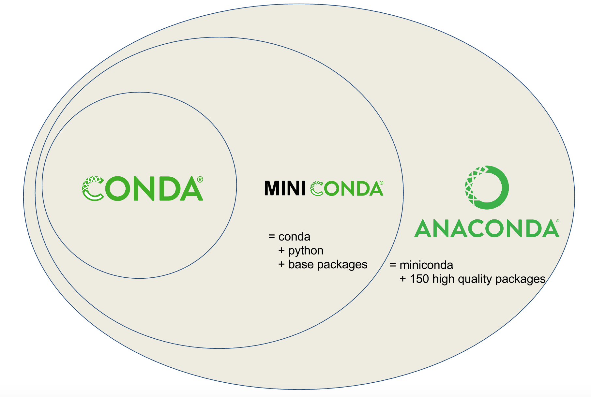
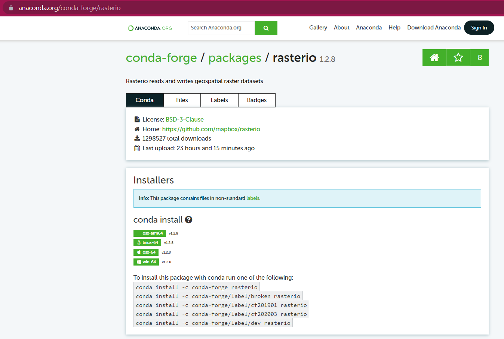

```{r setup, include=FALSE}
options(htmltools.dir.version = FALSE)
```

```{r xaringan-themer, include=FALSE, warning=FALSE}
library(xaringanthemer)
library(xaringanExtra)
library(tidyverse)
library(knitr)
library(nomnoml)
library(countdown)
xaringanExtra::use_logo(
  image_url = "https://raw.githubusercontent.com/rstudio/hex-stickers/master/PNG/xaringan.png"
)
xaringanExtra::use_panelset()
xaringanExtra::use_broadcast()
xaringanExtra::use_share_again()
xaringanExtra::style_share_again(share_buttons = c("twitter", "linkedin"))
xaringanExtra::use_tachyons()
xaringanExtra::use_fit_screen()
xaringanExtra::use_tile_view() # O
style_mono_accent(
  base_color = "#0dc96f",
  background_color = "#ffffff",
  inverse_background_color = "#3298cb",
  header_color = "#022044",
  inverse_header_color = "#ffffff", 
  inverse_text_color = "#ffffff",
  code_inline_color = "#179c55",
  link_color= "#0000FF",
  text_font_size = "25px",
  header_font_google = google_font("Poppins", "Regular", "400"),
  text_font_google   = google_font("Darker Grotesque", "500"),
  code_font_google   = google_font("Fira Mono"),
  )

```

```{r metathis, warning=FALSE, echo=FALSE}
# library(metathis)
# meta() %>%
#   meta_name("github-repo" = "flor14/rladies-jujuy") %>% 
#   meta_social(
#     title = "Meetup R-Ladies Jujuy",
#     description = paste(
#       "Mi próximo artículo científico con R:", 
#       "Compendios de Investigación, Reproducibilidad e",
#       "Interactividad en las publicaciones académicas"
#     ),
#     url = "https://flor14.github.io/rladies-jujuy/presentacion.html?panelset=licencia#1",
#     image = "https://res.cloudinary.com/flor/image/upload/v1608248822/jujuy-colores_frmvax.jpg",
#     image_alt = paste(
#       "Charla para el capítulo de R-Ladies de Jujuy, Argentina.",
#       "Diciembre de 2020"
#       ),
#     og_type = "website",
#     og_author = "Florencia D'Andrea",
#     twitter_card_type = "summary_large_image",
#     twitter_creator = "@cantoflor_87",
#     twitter_site = "@cantoflor_87"
#   )
```


class: middle, center

```{r hex, fig.align='center', echo = FALSE, out.width=150} 
    knitr::include_graphics("img/hex.png")
```


---


class: bottom

.bg-washed-blue.b--dark-blue.ba.bw2.br3.shadow-5.ph4.mt5[
### DSCI 521 - Lecture 8 
### **Getting help, virtual environments, and some tips and tricks**

 .large[#### Computing Platforms for Data Science - UBC MDS 2021/22
]]


---

## Lecture learning goals

1. Access function **documentation**.
--

2. **Ask questions** effectively.

--
3. Create a **minimal reproducible examples**.

--
4. Manage **virtual environments** with conda and renv.
---

class: middle, inverse

## Accessing help in R and Python

---
## Accessing help in R and Python

##### R and Python

- Preface a function `?` to view the documentation. e.g. ?len or ?seq. 


##### shortcuts 
- In **RStudio**, you can press `F1`  

- In **JupyterLab**, you can press `Shift` + `TAB` or have the **contextual help** open on the side as you type.

---

## Asking effective questions
#### Why even bother?
- Asking questions effectively means that the person helping you will be able to answer your question **better and quicker**.

- When you are asking for help online, remember that you are often receiving help from people who are **volunteering their time**. 

---

You might be frustrated by a problem...
--

### WHY IS THIS CODE NOT WORKING??????


Don't do this.
No one will help you.
You will get more frustrated.

---


```{r ch2, fig.align='center', echo = FALSE, out.width=600} 
knitr::include_graphics("img/code_hero.jpg")
```

.footnote[[Illustration by Alison Horst](https://github.com/allisonhorst)]


---

class: middle

### Writing down questions properly has another superb quality 
### **they help you solve your own problems**


---

class: middle, inverse, center

## How to ask effectively
---
class: middle
### In essence, you want to make your question 
### as **easy to understand** and 
### as **easy to reproduce** as possible 


---
### Minimal reproducible example

Also known as...

- **MRE** Minimal Reproducible Example
- **MCVE** Minimal Complete Verifiable Example
- **MWE** Minimal Working Example
- **reprex** REPRoducible EXample


---

### Minimal reproducible example

-  Search for other questions similar to yours.


> **Tip!** Search like a Pro

```{r gg, fig.align='center', echo = FALSE, out.width=500} 
    
```
.footnote[[Image extracted from 23 Google Search Tips You'll Want to Learn - PCMAG](https://www.pcmag.com/how-to/23-google-search-tips-youll-want-to-learn)]


---
### Minimal reproducible example
-  Search for other questions similar to yours.

```{r tw, echo=FALSE, fig.align='center', message=FALSE, warning=FALSE, out.width=500}
  
library(tweetrmd)
tweet_screenshot(
  tweet_url("denicmarko", "1434817434771406848"),
  maxwidth = 300,
  hide_media = TRUE
)
```
.footnote[[Tweet](https://twitter.com/denicmarko/status/1434817434771406848?s=09)]

---
### Minimal reproducible example
-  Search for other questions similar to yours.

```{r gg2, fig.align='center', echo = FALSE, out.width=350} 
    
```


.footnote[[Tweet](https://twitter.com/CatchTheBaby/status/1432124463399641088)]

---

### Minimal reproducible example
-  Search for other questions similar to yours.

> **Other tip!** Are you including all the keywords?


---

### Minimal reproducible example
- Describe the issue clearly in the title and elaborate briefly in the text body.


```{r title, fig.align='center', echo = FALSE, out.width=800} 
    
```

.footnote[[How do I ask a good question](https://stackoverflow.com/help/how-to-ask)]

---
### Minimal reproducible example
- Reduce the code to the **minimum required** to recreate your error, and paste it as text.
- If your code includes functions or classes, **include their definitions**.


---
### Minimal reproducible example

- Create small toy dataset instead of using real data.

> **Tip!** There are functions that help you to share datasets easily!

--

#### Example in R

- `dput()` or `datapasta` package (tidyverse)

```{r}
dput(head(iris,4)) #copy and paste the output in your console!
```

---


### Minimal reproducible example

- Use **markdown code blocks** for proper indentation and syntax highlighting.
- **Inline code** should be surrounded by **single backticks** for clarity. 


This is `inline` code

```R
# this is a code block

print("hello world")

```

---
### Minimal reproducible example
- Describe what you have tried so far, what you don't understand or what went wrong, including any **error messages** and their full traceback.  

--

The points are elaborated on below:
  - **Search for other questions similar to yours**
  
--

  - **Write the title as a summary of your issue**   
  Just "Error" or "Question" is not helpful, but "How to list content in a folder?" is.     

--

  - **Introduce the problem by briefly describing what you want to do.**

---


### Minimal reproducible example

- **Show what you have tried**, explain what you expected to happen, and what went wrong. 
- For coding questions, **text is preferred over a screenshot** since it is easy to copy and paste, which facilitates **reproducing** your problem.


---

### Minimal reproducible example

- **Include versions of any packages you are using**, and the operating system if relevant, e.g. Win10, Python 3.8, pandas 1.0.2. 


#### R 
`devtools::session_info()` to see this information       
(after `install.packages("devtools")`) 


#### Python 
`sinfo()`    
(after importing: `from sinfo import sinfo`, needs to be installed via `pip install sinfo`).

---

### Minimal reproducible example

- **When your problem is solved, acknowledge the solution**, close the issue/ticket/question. If you found the solution yourself, post it in a comment before closing, so that others can find it.


---


## Exercise


**Error when running script in R**

I'm trying to run an R script, which can be found here with the command plot_trace.R -m ./log.model.csv ./log.trace.csv.

The full code can be found [here]() and the data [here]().

This produces the error:

Error in `:=`(variable, as.character(variable)) : 
  Check that is.data.table(DT) == TRUE. Otherwise, := and `:=`(...) are defined for use in j, once only and in particular ways. See help(":=").
Calls: [ -> [.tbl_df -> check_names_df -> :=

Thanks

---


### Answer

* it is providing all the code and data, not a minimal example

--

* it is not using markdown for the error output or inline code

--

* there is not info about the environment: packages versions and software used

--

* there is not information about what the code is for 

--

* the title it is not written as a summary of the issue

---

# Hello! 👋

I would like to share with you this code. Let me know if you have any problem.

[![badge](https://img.shields.io/badge/run-binder-E66581.svg?logo=data:image/png;base64,iVBORw0KGgoAAAANSUhEUgAAAFkAAABZCAMAAABi1XidAAAB8lBMVEX///9XmsrmZYH1olJXmsr1olJXmsrmZYH1olJXmsr1olJXmsrmZYH1olL1olJXmsr1olJXmsrmZYH1olL1olJXmsrmZYH1olJXmsr1olL1olJXmsrmZYH1olL1olJXmsrmZYH1olL1olL0nFf1olJXmsrmZYH1olJXmsq8dZb1olJXmsrmZYH1olJXmspXmspXmsr1olL1olJXmsrmZYH1olJXmsr1olL1olJXmsrmZYH1olL1olLeaIVXmsrmZYH1olL1olL1olJXmsrmZYH1olLna31Xmsr1olJXmsr1olJXmsrmZYH1olLqoVr1olJXmsr1olJXmsrmZYH1olL1olKkfaPobXvviGabgadXmsqThKuofKHmZ4Dobnr1olJXmsr1olJXmspXmsr1olJXmsrfZ4TuhWn1olL1olJXmsqBi7X1olJXmspZmslbmMhbmsdemsVfl8ZgmsNim8Jpk8F0m7R4m7F5nLB6jbh7jbiDirOEibOGnKaMhq+PnaCVg6qWg6qegKaff6WhnpKofKGtnomxeZy3noG6dZi+n3vCcpPDcpPGn3bLb4/Mb47UbIrVa4rYoGjdaIbeaIXhoWHmZYHobXvpcHjqdHXreHLroVrsfG/uhGnuh2bwj2Hxk17yl1vzmljzm1j0nlX1olL3AJXWAAAAbXRSTlMAEBAQHx8gICAuLjAwMDw9PUBAQEpQUFBXV1hgYGBkcHBwcXl8gICAgoiIkJCQlJicnJ2goKCmqK+wsLC4usDAwMjP0NDQ1NbW3Nzg4ODi5+3v8PDw8/T09PX29vb39/f5+fr7+/z8/Pz9/v7+zczCxgAABC5JREFUeAHN1ul3k0UUBvCb1CTVpmpaitAGSLSpSuKCLWpbTKNJFGlcSMAFF63iUmRccNG6gLbuxkXU66JAUef/9LSpmXnyLr3T5AO/rzl5zj137p136BISy44fKJXuGN/d19PUfYeO67Znqtf2KH33Id1psXoFdW30sPZ1sMvs2D060AHqws4FHeJojLZqnw53cmfvg+XR8mC0OEjuxrXEkX5ydeVJLVIlV0e10PXk5k7dYeHu7Cj1j+49uKg7uLU61tGLw1lq27ugQYlclHC4bgv7VQ+TAyj5Zc/UjsPvs1sd5cWryWObtvWT2EPa4rtnWW3JkpjggEpbOsPr7F7EyNewtpBIslA7p43HCsnwooXTEc3UmPmCNn5lrqTJxy6nRmcavGZVt/3Da2pD5NHvsOHJCrdc1G2r3DITpU7yic7w/7Rxnjc0kt5GC4djiv2Sz3Fb2iEZg41/ddsFDoyuYrIkmFehz0HR2thPgQqMyQYb2OtB0WxsZ3BeG3+wpRb1vzl2UYBog8FfGhttFKjtAclnZYrRo9ryG9uG/FZQU4AEg8ZE9LjGMzTmqKXPLnlWVnIlQQTvxJf8ip7VgjZjyVPrjw1te5otM7RmP7xm+sK2Gv9I8Gi++BRbEkR9EBw8zRUcKxwp73xkaLiqQb+kGduJTNHG72zcW9LoJgqQxpP3/Tj//c3yB0tqzaml05/+orHLksVO+95kX7/7qgJvnjlrfr2Ggsyx0eoy9uPzN5SPd86aXggOsEKW2Prz7du3VID3/tzs/sSRs2w7ovVHKtjrX2pd7ZMlTxAYfBAL9jiDwfLkq55Tm7ifhMlTGPyCAs7RFRhn47JnlcB9RM5T97ASuZXIcVNuUDIndpDbdsfrqsOppeXl5Y+XVKdjFCTh+zGaVuj0d9zy05PPK3QzBamxdwtTCrzyg/2Rvf2EstUjordGwa/kx9mSJLr8mLLtCW8HHGJc2R5hS219IiF6PnTusOqcMl57gm0Z8kanKMAQg0qSyuZfn7zItsbGyO9QlnxY0eCuD1XL2ys/MsrQhltE7Ug0uFOzufJFE2PxBo/YAx8XPPdDwWN0MrDRYIZF0mSMKCNHgaIVFoBbNoLJ7tEQDKxGF0kcLQimojCZopv0OkNOyWCCg9XMVAi7ARJzQdM2QUh0gmBozjc3Skg6dSBRqDGYSUOu66Zg+I2fNZs/M3/f/Grl/XnyF1Gw3VKCez0PN5IUfFLqvgUN4C0qNqYs5YhPL+aVZYDE4IpUk57oSFnJm4FyCqqOE0jhY2SMyLFoo56zyo6becOS5UVDdj7Vih0zp+tcMhwRpBeLyqtIjlJKAIZSbI8SGSF3k0pA3mR5tHuwPFoa7N7reoq2bqCsAk1HqCu5uvI1n6JuRXI+S1Mco54YmYTwcn6Aeic+kssXi8XpXC4V3t7/ADuTNKaQJdScAAAAAElFTkSuQmCC)](https://mybinder.org/v2/gh/flor14/environments_binder_lecture8/HEAD/?urlpath=rstudio)
--
  

Package version of `tidyr 0.8.3` does not include `pivot_longer()` and `pivot_wider()` functions added in `tidyr version 1.0.0`

Use `sessionInfo()` to check this

.footnote[This is an R example to understand why it is important to manage your environments]
---

class: middle, center, inverse

## Virtual environments

---

## Virtual environments

- You can have multiple versions of packages and programs on the same computer without them creating conflicts with each other.


- You will be using virtual **Python** and **R environments** throughout the program to setup your packages for different courses.

---

## Conda 

- **conda** is an **open source package** and **environment management system** for any programming language

- It is the most popular in the python community. 

```{r cc, fig.align='center', echo = FALSE, out.width=300} 
    knitr::include_graphics("img/conda.png")
```


---

## Conda 

Conda as a **package manager** helps you find and install packages.   
If you need a package that requires a different version of Python, you do not need to switch to a different environment manager, because Conda is also an **environment manager**.

```{r cc2, fig.align='center', echo = FALSE, out.width=300} 
    knitr::include_graphics("img/conda.png")
```

.footnote[[Introduction to Conda for (Data) Scientists - The Carpentries](https://carpentries-incubator.github.io/introduction-to-conda-for-data-scientists/01-getting-started-with-conda/index.html)]
---
## Conda

- **Anaconda** is a data science platform for Python that comes with a lot of packages by default. 
- **Miniconda** doesn't come with any installed packages by default, and we can pick and choose which ones we want. 

Both include Python and conda.

```{r anac, fig.align='center', echo = FALSE, out.width=400} 
    
```


.footnote[[Introduction to Conda for (Data) Scientists - Software Carpentry](https://carpentries-incubator.github.io/introduction-to-conda-for-data-scientists/01-getting-started-with-conda/index.html)]

---

## Managing Conda


What version of conda is installed?

```bash
conda --version
```
Conda commands are available, type conda `--help`. 

```bash
conda update --help
```
- Update our conda to the latest version: 

```bash
conda update conda
```

---

## Managing Conda

```bash
Using Anaconda Cloud api site https://api.anaconda.org
Fetching package metadata: ....
.Solving package specifications: .........

Package plan for installation in environment //anaconda:

The following packages will be downloaded:

    package                    |            build
    ---------------------------|-----------------
    conda-env-2.6.0            |                0          601 B
    ruamel_yaml-0.11.14        |           py27_0         184 KB
    conda-4.2.12               |           py27_0         376 KB
    ------------------------------------------------------------
                                           Total:         560 KB
```

---

class: middle

### What is a conda environment and why is it so useful?

--

### Using conda, you can create an **isolated python environment for your project**


---


## What is an Environment?

.bg-washed-blue.b--dark-blue.ba.bw2.br3.shadow-5.ph4.mt5[
 An environment is a set of packages that can be used in one or multiple projects.
]
--
#### **Benefits** of using environments:
  - You can guarantee that someone else can **reproduce your project** by specifying which package versions your used.  

--
  - If two of your projects relies on different versions of the same package, you can install these in **different environments**.  

--
  - If you want to play around with a **new package**, you don't have to change the packages you use for your data analysis.  

--
  - When you **develop your own packages** you want to to make sure you know exactly which packages yours depend on.  


---

## Base environment

Conda has a default environment called **base**

- that include a Python installation and
- some core system libraries and dependencies of Conda. 

It is a **“best practice”** to avoid installing additional packages into your base software environment. 
 

---

## Creating Conda environments

There are two ways of creating a conda environment.

##### 1. Creating environment by manually specifying packages  

--
##### 2. An environment file in YAML format (*environment.yaml*).

---

## Creating Conda environments
#### 1. Creating environment by manually specifying packages
We can create `test_env` conda environment by typing `conda -n <name-of-env>`. 

```bash
conda create -n test_env -c conda-forge python=3.7 jupyterlab pandas=1.0.2
```

.bg-washed-blue.b--dark-blue.ba.bw2.br3.shadow-5.ph4.mt5[
 conda will solve any dependencies between the packages like before and create a new environment with those packages. 

]

---

## Creating Conda environments
#### 1. Creating environment by manually specifying packages

- Usually, we don't need to specify the channel, but in this case I want to get the very latest version of these packages, and they are made available in `conda-forge` before they reach the default conda channel.

---
## Creating Conda environments
#### 1. Creating environment by manually specifying packages

To activate this new environment, you can type

```bash
conda activate test_env 
```

```bash
conda deactivate 
```
--

To see all your environments, you can type:

```bash
conda env list
```
---
## Creating Conda environments
#### 2. An environment file in YAML format (*environment.yaml*).

Exporting your environment to a file called `environment.yaml` (the extension can be either `.yaml` or `.yml`):

---


## Sharing Environments with others
Export your conda environment to an environment file, which will list each package and its version.


```bash
conda env export -f environment.yaml
```
Remember that `.yaml` files are plain text, so you can use a text editor such as **VS Code** to open them. 


---
## Sharing Environments with others

The environment file has A LOT more packages than ``jupyterlab` and `pandas`. 

👉 **list the dependencies** that were installed together with these packages, e.g. `numpy`. 

.bg-washed-blue.b--dark-blue.ba.bw2.br3.shadow-5.ph4.mt5[
This is good in the sense that it gives an exact copy of everything in your environment.
]


---
## Sharing Environments with others

Some dependencies might **differ between operating systems**

append the `--from-history` flag which look at the history of the packages you explicitly told conda to install and only list those in the export. 

.bg-washed-blue.b--dark-blue.ba.bw2.br3.shadow-5.ph4.mt5[
The required dependencies will then be handled in an OS-specific manner during the installation, which guarantees that they will work across OSes. 
]


---
class: middle
### Importantly, this will not include the package version unless you included it when you installed with the **package==version** syntax. 
--
### For an environment to be **reproducible**, you NEED to add the version string manually.

---
### Creating environment from an environment file
Now, let's install `environment.yaml` environment file above so that we can create a conda environment called `test_env`.

```bash
$ conda env create --file environment.yaml
```
---

## Copying an environment

We can make an exact copy of an environment to an environment with a different name. In this example, **test_env** is cloned to create **live_env**.


```bash
conda create --name live_env --clone test_env
```
 This maybe useful for any testing versus live environments or different Python 2.7 versions for the same packages.
---
## Deleting an environment

Since we are only testing out our environment, we will delete **live_env**.

```bash
conda env remove -n live_env
```

---

class: inverse, middle, center
## Managing Packages


---
## Managing Packages
#### Seeing what packages are available
We will now check packages that are available to us. The command below will list all the packages in an environment, in this case **test_env**. 

```bash
conda list
```

Some packages might not be available in conda, but are available in [`pypi`](https://pypi.org/). 


---

## Managing Packages
In this example, we will use `rasterio` from `conda-forge`. 

With conda you can do this search within the command line:

```bash
conda search rasterio
```

---

## Managing conda

Under the name column of the result in the terminal or the package column in the Anaconda Cloud listing, shows the necessary information to install the package. e.g. conda-forge/rasterio. 


```{r gg3, fig.align='center', echo = FALSE, out.width=600} 

```

.footnote[www.anaconda.org/conda-forge/rasterio]

---

## Managing conda


To install the latest version available within the channel, do not specify in the install command. We will install version 0.35 of `rasterio` from `conda-forge` into **test_env** in this example. 

```bash
conda install -c conda-forge rasterio=0.36
```

If you have a few trusted channels that you prefer to use, you can pre-configure these so that everytime you are creating an environment, you won't need to explicitly declare the channel.

```bash
conda config --add channels conda-forge
```

---
### Removing a conda Package
Note that this will remove the main package `rasterio` and its dependencies (unless a dependency was installed explicitly at an earlier point in time or is required be another package).

```bash
conda remove -n test_env rasterio
```


---

class: center

## R

**`renv` package**

```{r echo = FALSE}
knitr::include_graphics("img/renv.png")
```
.footnote[[Reproducible Environments - RStudio](https://environments.rstudio.com/)]
---

# `renv` package

1. 🏁 `renv::init()` works by creating a new library. A library stores installed packages.

--

2. 📸 `renv::snapshot()` creates a new file in your project titled `renv.lock`. The file contains all the information you need to communicate your project’s dependencies at the moment you call snapshot. 

--
3. 🌱 `renv::restore()` recreates the environment!


.footnote[[* Read more about `renv` here](https://environments.rstudio.com/snapshot.html#pre-requisite-steps)]
---

## References

.bg-washed-blue.b--dark-blue.ba.bw2.br3.shadow-5.ph4.mt5[

 [conda documentation](https://conda.io/)

 [How to ask help - StackOverflow](https://stackoverflow.com/help/how-to-ask)
 
 [Introduction to conda for (Data) Scientists](https://carpentries-incubator.github.io/introduction-to-conda-for-data-scientists/)
 
 [Minimal Reproducible Example - StackOverflow](https://stackoverflow.com/help/minimal-reproducible-example)
 
 [Reprex package - Tidyverse](https://reprex.tidyverse.org/)

 [The Turing Way Book](https://the-turing-way.netlify.app/)

 [Reproducible Environments - RStudio](https://environments.rstudio.com/)

 [renv: Project Environments with R - RStudio blog](https://blog.rstudio.com/2019/11/06/renv-project-environments-for-r/)

 [Python Packages - Tomas Beuzen & Tiffany Timbers](https://py-pkgs.org/)
]


---


class: inverse, middle, center


## Thank you!
